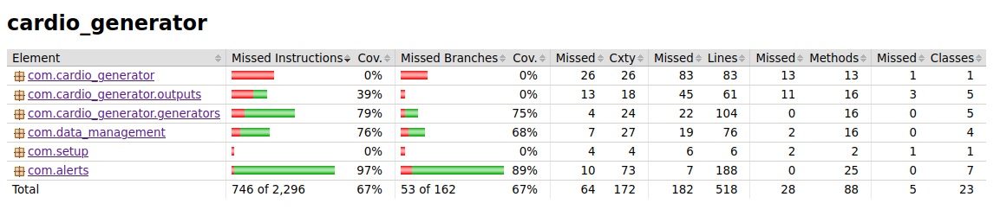
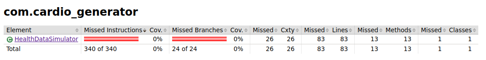
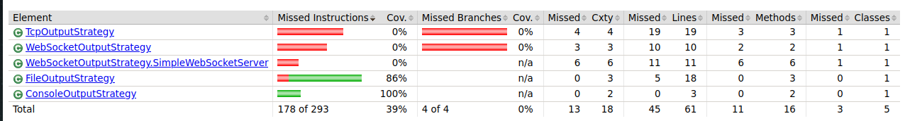
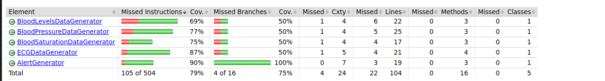
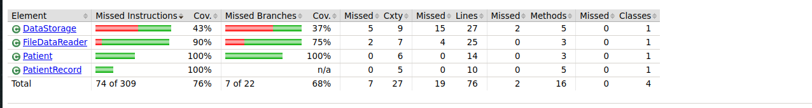
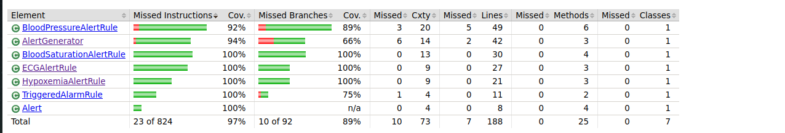

HealthDataSimulator class mainly consists of components without containing much of core logic.

TCP and WebSocket testing require more advanced setup and testing techniques.

Again, Main class mainly consists of components without containing much of core logic.
